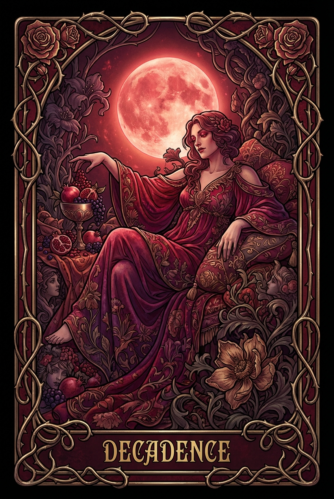

# Tarot Cards - See Yourself in the 22 Arcana

An interactive tarot card generator inspired by **Lord of the Mysteries**, where you can see yourself depicted in all 22 Major Arcana positions—just like Emperor Roselle's legendary cards.

## 🎴 Concept

Inspired by the web novel *Lord of the Mysteries*, where Emperor Roselle created tarot cards depicting himself in each divine pathway (The Fool, Black Emperor, Red Priest, etc.), this project brings that concept to life.

### Your Personal Tarot Deck

Generate a complete set of 22 animated tarot cards featuring **you** as the protagonist in each archetypal role:

- **Default**: Pre-filled with Aditya's personal journey through 22 life roles and vocations
- **Customizable**: Upload your own photo to generate your personalized deck
- **Multiple Traditions**: Choose from Lord of the Mysteries pathways, traditional Rider-Waite, Egyptian, Celtic, or Shinto interpretations

### Card Features

Each card includes:

1. **AI-Generated Imagery**: Your photo composed into the tarot archetype
2. **AI Video Generation**: Generates 8-second cinematic videos for each card using Google's **Veo 3.1** model (replacing static GIFs).
3. **Personal Lore**: Custom narrative about what that archetype means in your life
4. **Multiple Interpretations**: Switch between cultural/spiritual traditions
5. **Customizable Prompts**: Full control over the AI generation style

## ✨ Experience

### 3D Shuffled Deck Visualization

Cards float in 3D space like a mystical deck in motion:

- **Dynamic Shuffling**: Wild, chaotic animations where you glimpse individual cards
- **Floating & Drifting**: Cards gently bob and rotate in 3D space
- **Hover Interactions**: Cards orient toward you and whisper keywords
- **Touch Controls**: Full 3D experience on mobile with gesture support

### Card Interaction Flow

1. **Shuffled deck** floating dramatically in 3D space
2. **Pick/click a card** to select it
3. **Card flips and expands** with smooth animations
4. **View full details**: Cinematic video, lore, keywords, meanings, abilities

## 🛠️ Technical Stack

- **Frontend**: React + TypeScript + Vite
- **3D Graphics**: Three.js + React Three Fiber + Drei
- **Animations**: Framer Motion
- **State Management**: Zustand with persistence
- **AI Generation**: OpenRouter API (Gemini Pro, GPT-4o Mini, etc.)
- **Video Generation**: Google Gemini API (Veo 3.1)
- **Image Processing**: Custom video handling and asset management

## 🚀 Getting Started

### Prerequisites

- Node.js 18+
- **OpenRouter API Key**: For image generation ([get one here](https://openrouter.ai/keys))
- **Google Gemini API Key**: Required specifically for **Veo** video generation.

### Installation

```bash
# Install dependencies
npm install

# Start development server
npm run dev
```

The app will open at http://localhost:3000

## ⚙️ Configuration & Costs

The app is highly configurable via `src/data/tarot-config.json`. This file controls:

*   **Prompt Composition**: How the AI prompt is built using lore, deck context, and visual framing instructions.
*   **Cost Estimation**:
    *   **Image**: ~$0.003/image (Gemini Flash)
    *   **Video**: Uses Google's Veo 3.1 (Preview).
    *   *Note: Costs are estimates and depend on the specific model and provider.*

**Default Settings:**
*   Model: `gemini-2.5-flash-image`
*   Frames: 4 (for legacy sprite sheets) or Single Image + Video
*   Provider: Gemini or OpenRouter

## 🎴 Multi-Deck System

The project now supports deep lore customization. All deck data is located in `src/data/`.

*   **`tarot-decks.json`**: The core database. Contains definitions for every card across multiple interpretations (Lord of Mysteries, Egyptian, Celtic, etc.).
*   **`tarot-config.json`**: Global settings for prompt engineering and API handling.

**To add a new deck:**
1.  Add a new entry to `deckTypes` in `tarot-decks.json`.
2.  Add the corresponding key (e.g., `"cyberpunk"`) to every card object in `cards`.

## 🛠️ Scripts

*   **`npm run add-narratives`** (`scripts/add-narratives.cjs`):
    *   A utility script that merges rich narrative descriptions (summary, axis, feeling, scene) into your `tarot-decks.json` file.
    *   Useful if you want to reset or update the core card lore without manually editing the huge JSON file.

## 🔍 Sample Card



A sample output image for quick reference (visual style example).

## 📖 Using the Generator

### Test Before Generating All

1. Open **Settings** (⚙️ button in header)
2. Add your API keys
3. Upload your photo
4. Choose a deck type (Lord of the Mysteries recommended!)
5. **Generate ONE card first** to test your photo and prompt
6. Refine as needed, then generate all 22

## 🎭 Deck Types

### Lord of the Mysteries (Recommended)
22 Beyonder pathways from the novel, depicting divine sequences and cosmic powers

### Lord of the Mysteries — Masterpiece Edition
Extended lore with richer visual direction for the same 22 pathways

### Traditional Rider-Waite
Classic tarot symbolism with historical accuracy

### Egyptian Tarot
Ancient Egyptian deities and mythology

### Celtic Tarot
Celtic gods, goddesses, and druidic wisdom

### Japanese Shinto
Kami spirits and Japanese spiritual traditions

### Buddhist
Buddhist archetypes, bodhisattvas, and dharmic symbolism

### Advaita Vedanta
Non-dual Vedantic philosophy mapped onto the Major Arcana

## 📝 Customization Guide

All card data is in `src/data/tarot-decks.json`:

```json
{
  "number": 0,
  "personalLore": "FILL THIS: Your story for this card...",
  "lordOfMysteries": {
    "pathway": "Fool Pathway",
    "prompt": "Your custom prompt for AI generation..."
  }
}
```

### Personalizing Your Deck

1. Open `src/data/tarot-decks.json`
2. Find each card's `personalLore` field (marked "FILL THIS:")
3. Write your personal story for that archetype
4. (Optional) Customize the `prompt` field to change visual style
5. Save and regenerate cards with your stories

## 🌟 Features

- ✅ Full 3D card deck visualization with touch controls
- ✅ 8 different cultural/spiritual tarot interpretations
- ✅ AI-powered image generation with your photo
- ✅ Cinematic video generation for each card
- ✅ Persistent caching of generated cards
- ✅ Cost estimation before generation
- ✅ Test single card before generating all 22
- ✅ Fully customizable prompts and lore
- ✅ Responsive design for desktop and mobile

## 🏗️ Project Structure

```
tarot-cards/
├── src/
│   ├── components/           # React components
│   │   ├── card-deck/        # 3D floating deck (motion, curves, physics, visuals)
│   │   ├── card-detail/      # Card detail modal (preview, expanded, video fallback)
│   │   ├── settings/         # Settings panel sections + image hooks
│   │   ├── CardDeck.tsx      # Deck orchestrator (delegates to card-deck/)
│   │   ├── CardDetail.tsx    # Detail orchestrator (delegates to card-detail/)
│   │   ├── Settings.tsx      # Settings orchestrator (delegates to settings/)
│   │   ├── CommunityGallery.tsx  # Community gallery browser
│   │   ├── Header.tsx        # App header
│   │   └── ErrorNotification.tsx # Toast notification system
│   ├── data/                 # Card data
│   │   ├── tarot-decks.json  # All 22 cards × 8 interpretations
│   │   └── tarot-config.json # Configuration & Prompt Engineering
│   ├── hooks/                # Custom React hooks
│   │   ├── useCardGeneration.ts  # Image + video generation orchestration
│   │   └── useGallerySharing.ts  # Community gallery upload/download
│   ├── store/                # Zustand state management
│   │   └── useStore.ts
│   ├── types/                # TypeScript types
│   │   └── index.ts
│   ├── utils/                # Utilities
│   │   ├── imageGeneration.ts     # Multi-provider image AI (Gemini / OpenRouter)
│   │   ├── videoGeneration.ts     # Google Veo 3.1 video generation
│   │   ├── cardPhysics.ts         # 3D physics calculations
│   │   ├── idb.ts                 # IndexedDB abstraction layer
│   │   ├── communityGallery.ts    # Supabase gallery data normalization
│   │   ├── exportGeneratedCardsZip.ts  # ZIP export
│   │   └── logger.ts              # Debug logging gate
│   ├── App.tsx            # Main app component
│   ├── main.tsx           # Entry point
│   └── index.css          # Global styles
├── public/                # Static assets
├── scripts/               # Build & Maintenance scripts
├── package.json
├── vite.config.ts
└── README.md
```

## 🤝 Contributing

This is a personal project, but suggestions are welcome! Open an issue or submit a pull request.

## 📜 License

ISC

---

_"I am both The Fool and The World—the journey and the destination."_

Inspired by **Lord of the Mysteries** by Cuttlefish That Loves Diving
Built with ❤️ by Aditya
